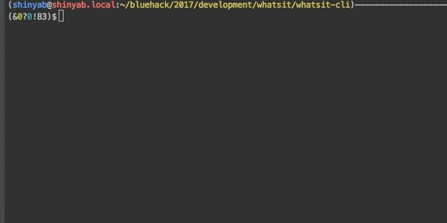
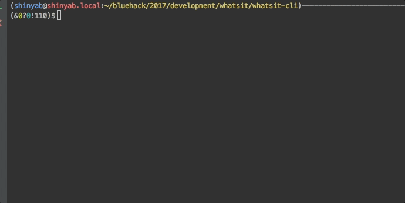

WhatsIt-cli
===========

WhatsIt-cli is an open source project that lets you run the WhatsIt's API in a console environment.

### Install
WhatsIt-cli is available on NPM. Install it as a global dependency to be able to use `whatsit` command anywhere
> npm install whatsit-cli --global

### Use
You can use login management, project and dataset related Whatsit API functions in a console environment.

## login
WhatsIt login is associating with Github. You should have a Github account.

> whatsit login
 
## Project
 `project` options can create a new projects and view projects or trainset.
 ### Sub options
 - `-l` Retrieve all of projects
 - `-a` Add a new project

 
 
## Trainset
 `trainset` options can retrieve trainset. Specially, you can specify the type of trainset
 ### Sub options
  - `-l` Retrieve all of trainset
  - `-t` Retrieve trainsets as specified format
 

## dataset
 `dataset` options can create a new dataset and view dataset.
 ### Sub options
   - `-l` Retrieve all of dataset
   - `-a` Add a new dataset. In this case, cli provides dummy data for testing
   - `-g` Retrieve a dataset. 
   - `-u` Update dataset
   

## help
 `help` options can print this help

### License
MIT -- see [LICENSE](LICENSE)
